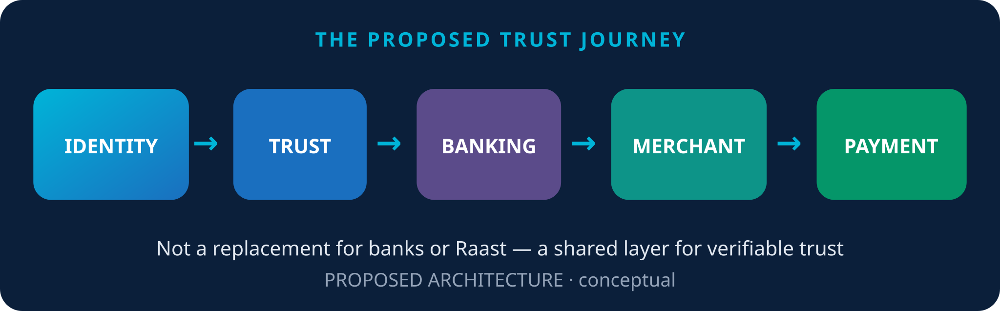

# Executive Summary

Pakistan’s digital finance stack is growing. The costly part is not always the payment rail — it is **repeated trust work**: KYC, CDD, merchant onboarding, and compliance checks done over and over across institutions.

## Eight answers in one page

1. **What is wrong today?** Customers and merchants often repeat verification across banks, EMIs, PSPs and gateways.
2. **What has Pakistan already built?** Shared e-KYC (DLT-based exchange concepts), Raast, and Raast P2M (QR, Alias, IBAN, Request to Pay). [[1]](../sections/99-references.md#1) [[2]](../sections/99-references.md#2) [[3]](../sections/99-references.md#3)
3. **What is proposed?** **PFFTN** — a federated, permissioned financial trust network.
4. **Why DLT?** Not to store CNICs on a chain — to share **proofs** that verification already happened.
5. **Customers:** prove once via verifiable credentials; institutions still decide.
6. **Merchants:** a reusable **Merchant Financial Identity (MFI)** could reduce repeated onboarding.
7. **Raast:** remains the payment rail; PFFTN would wrap identity/trust around it.
8. **Why it matters:** less friction, better provenance, regulated federation — not permissionless DeFi.


**In simple terms:** every bank checking you separately → you prove who you are once → authorized institutions verify the proof.


*The proposed trust journey*
