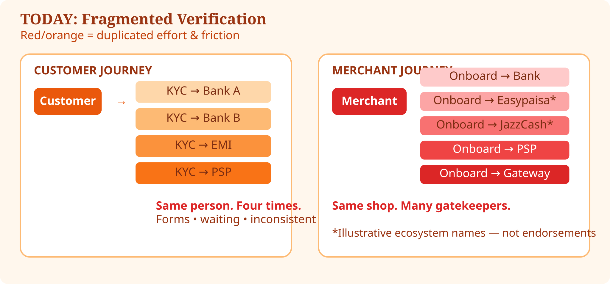

# 1. The Problem


**Current State** — fragmented verification today.


Pakistan’s ecosystem includes banks, microfinance banks, EMIs, PSOs and PSPs. Growth is good. **Fragmented trust is expensive.**

**In simple terms:** every time you open a new financial relationship, you often restart “prove who you are” — even when another regulated institution already knows you.

### Customer friction

* KYC → Bank A
* KYC → Bank B
* KYC → EMI
* KYC → PSP

### Merchant friction

* Onboarding → Bank
* Onboarding → EMI / wallet acquirer
* Onboarding → PSP / gateway

Duplication creates inconsistent data, higher compliance cost, slower inclusion, and stale information.

  

*Figure 2 — The banking problem today*
