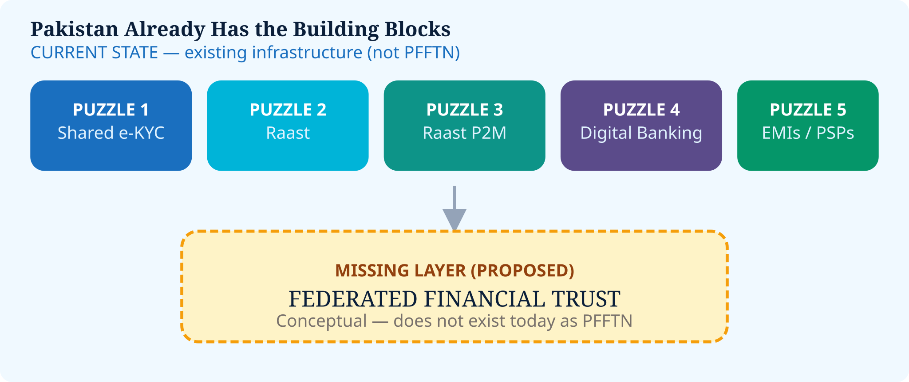

# 2. The Existing Pakistan Foundation


**Current State** — this proposal does **not** treat Pakistan as starting from zero.


## Building blocks already in place

1. **Shared e-KYC** — SBP BPRD Circular Letter No. 22 of 2023 (Implementation of Shared Electronic Know Your Customer Platform). [[1]](99-references.md#1) Public descriptions state the platform uses DLT, enables secure KYC/CDD exchange and updates, standardization, and consent-based access, while underlying KYC/CDD information remains with banks. [[4]](99-references.md#4) [[5]](99-references.md#5)
2. **Raast** — Pakistan’s instant payment system.
3. **Raast P2M** — PSP&OD Circular No. 04 of 2023 launched Person-to-Merchant service for banks, MFBs, EMIs, PSOs & PSPs, supporting QR, Raast Alias, IBAN and Request to Pay. [[2]](99-references.md#2)
4. **Digital merchant onboarding** — PSP&OD Circular Letter No. 01 of 2024 requires new-to-bank merchants/businesses to be enabled for Raast P2M during onboarding. [[3]](99-references.md#3)
5. **Banks, MFBs, EMIs, PSOs, PSPs** under SBP oversight
6. **Customer consent** as a design expectation in shared KYC
7. **DLT** already in the national KYC conversation


Pakistan has already built several pieces of the puzzle. The conceptually missing piece is a broader **federated trust layer**.


*Figure 3 — Building blocks and the missing federated trust layer*
