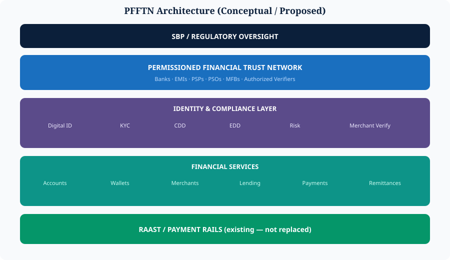

# 3. The New Architecture — PFFTN


**Proposed Architecture** — conceptual. **Not** an existing SBP system.


## Pakistan Federated Financial Trust Network (PFFTN)

**Objective:** a common trust layer between banks, MFBs, EMIs, PSPs, PSOs, merchants, customers, identity providers, regulators and government verification services.

| Traditional banking | Federated banking |
| --- | --- |
| Every bank checks you separately | You prove who you are once; authorized institutions verify the proof |

**Blockchain/DLT becomes:** a shared machine for proving that something has already been verified.

**Design rule:** store sensitive data **off-chain**. Store proofs, attestations, hashes, permissions and state transitions **on-chain**.

  

*Figure 4 — Proposed PFFTN layered architecture*
