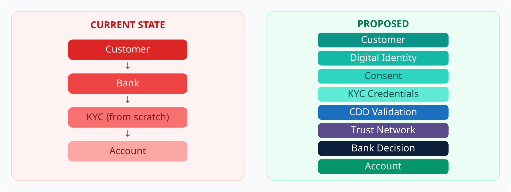

# 4. Account Opening


**Proposed Architecture**


The blockchain would **not** approve customers autonomously. Regulated institutions remain responsible for onboarding decisions. The network provides trusted, verifiable evidence.

*Figure 5 — Account opening: current vs proposed*


**Responsibility stays with the institution.** Shared credentials are evidence infrastructure — not a liability shield.

