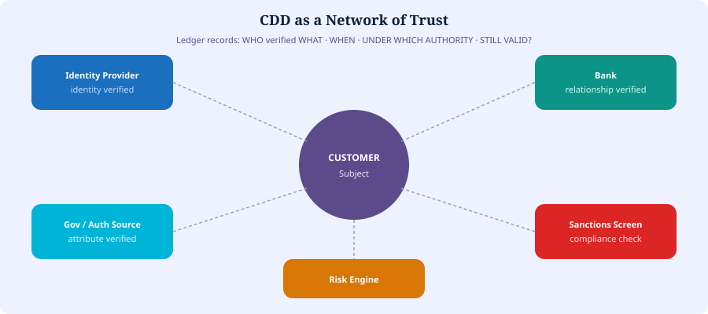

# 5. CDD as Distributed Validation


**Proposed Architecture**


Customer Due Diligence can be a **network of attestations**:

1. Identity Provider → identity verified
2. Bank → customer relationship verified
3. Government / authorized source → attribute verified
4. Compliance system → sanctions screening
5. Risk engine → risk assessment

The ledger would record: **who** verified **what**, **when**, under **which authority**, and whether it is **still valid**.


**In simple terms:** CDD becomes a team sport with signed scorecards — not one bank reinventing the checklist every time.


*Figure 6 — CDD as a network of trust*
