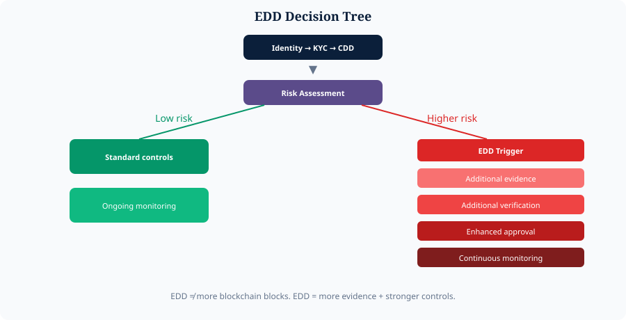

# 6. EDD as Enhanced Verification


**Proposed Architecture**


EDD should **not** mean “more blocks.”

**EDD = additional evidence + additional verification + stronger controls.**

* Lower-risk: Identity → KYC → CDD → proportionate controls → monitoring
* Higher-risk: … → risk trigger → EDD → more evidence → enhanced approval → continuous monitoring

*Figure 7 — EDD decision tree*
