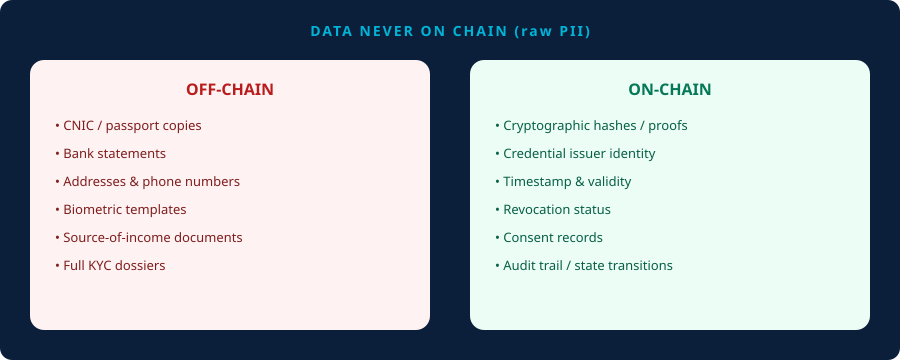
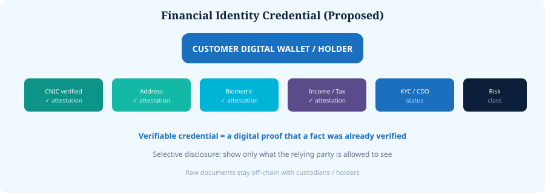

# 7. Digital Financial Identity


**Proposed Architecture**


A customer could hold a **Financial Identity Credential** with verifiable attributes such as identity/CNIC/address/biometric verification status, income/tax status, ownership attributes where relevant, risk classification, and KYC/CDD/EDD status.


**Verifiable credential** — a digital proof that someone has already verified a particular fact.


Aligned with W3C Verifiable Credentials concepts. [[7]](99-references.md#7)

*Figure 8 — Data never on chain (raw PII)*

*Figure 9 — Financial Identity Credential*
