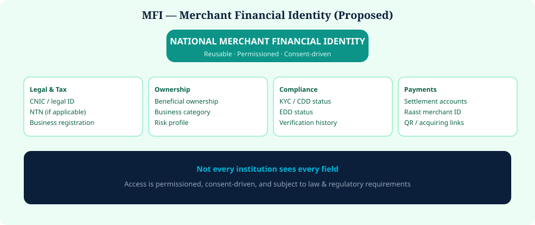

# 8. National Merchant Identity


**Proposed Architecture**


## MFI — Merchant Financial Identity

A reusable merchant trust profile could include attestations about legal identity, NTN (where applicable), registration, beneficial ownership, category, risk, KYC/CDD/EDD status, settlement accounts, Raast merchant identity, QR identity, acquiring relationships and verification history.

**Not every institution receives every field.** Access would be permissioned, consent-driven, and subject to law.

  

*Figure 10 — Merchant Financial Identity (MFI)*
