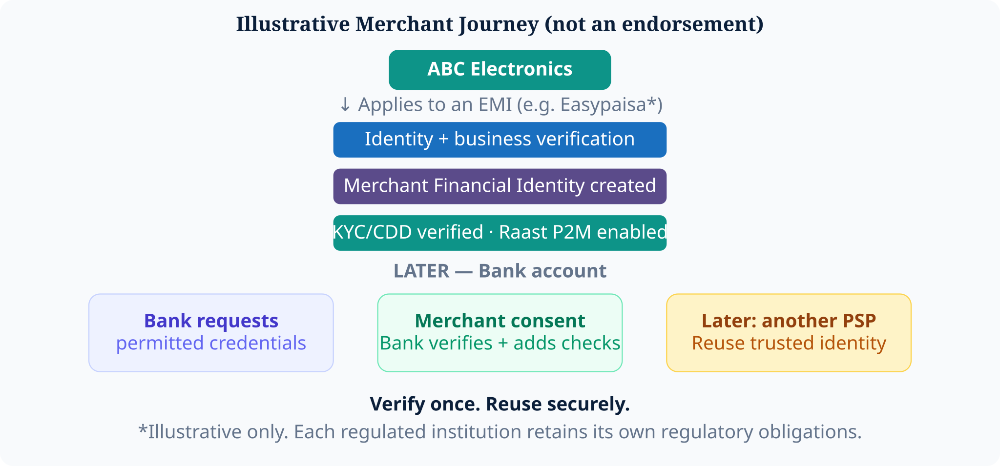

# 9. EMI / Bank / PSP Journeys


**Proposed Architecture** — illustrative example only.


For illustration, consider a merchant onboarding journey involving an EMI such as Easypaisa. **This does not imply** that Easypaisa, JazzCash, any bank, or SBP has agreed to this proposal.

**Verify once. Reuse securely.** Each regulated institution still meets its own obligations.

*Figure 11 — Illustrative merchant journey*
