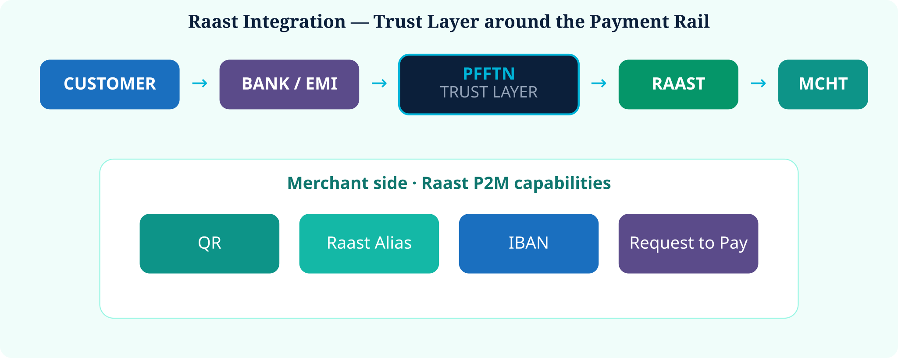

# 10. Raast Integration


**Current State + Proposed** — PFFTN is **not** a replacement for Raast.


Raast remains the payment rail. PFFTN would be the trust and identity layer around payments.

SBP launched Raast P2M with QR, Alias, IBAN and Request to Pay. [[2]](99-references.md#2) Later instructions push merchant enablement during onboarding. [[3]](99-references.md#3)

  

*Figure 12 — Raast integration architecture*
