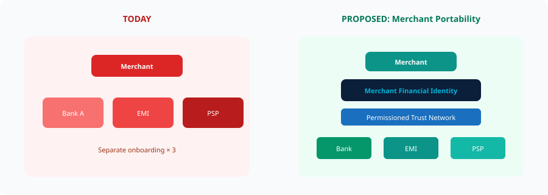

# 11. Merchant Portability


**Proposed Architecture**


**Merchant Portability** means a verified merchant identity could travel — with consent and legal authority — across banks, EMIs and PSPs, while each institution keeps its own controls.

*Figure 13 — Merchant portability*
