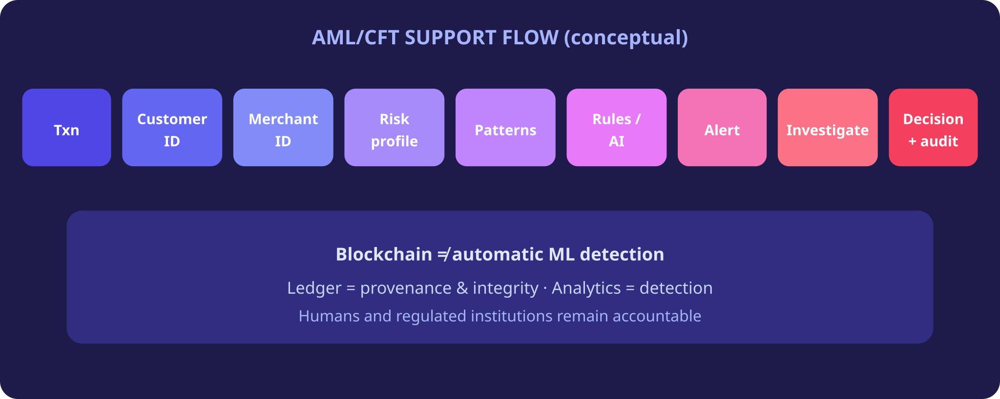

# 12. Transaction Monitoring


**Proposed Architecture**


The trust layer could support AML/CFT by linking customer identity, merchant identity, risk profiles and auditable investigation records.


Blockchain does **not** automatically detect money laundering. Analytics and humans detect; the ledger strengthens provenance and integrity. [[8]](99-references.md#8) [[9]](99-references.md#9)


*Figure 14 — AML/CFT support flow*
