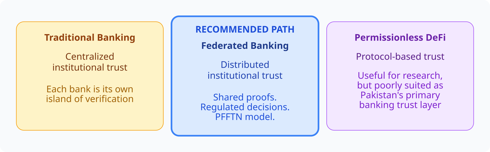

# 13. Decentralized Banking vs Decentralized Trust

Pakistan should likely pursue a **regulated federated model**, not permissionless DeFi, for core banking trust.

*Figure 15 — Traditional vs federated vs DeFi*

| Dimension | Traditional | Federated (PFFTN-style) | Permissionless DeFi |
| --- | --- | --- | --- |
| Trust source | Institution | Institutions + shared proofs | Protocol / code |
| Who can join | Licensed only | Permissioned participants | Anyone with a wallet |
| KYC/AML fit | Native | Designed for | Often weak / external |
| Pakistan core-banking fit | Works, costly duplication | Strong conceptual fit | Poor primary fit |
