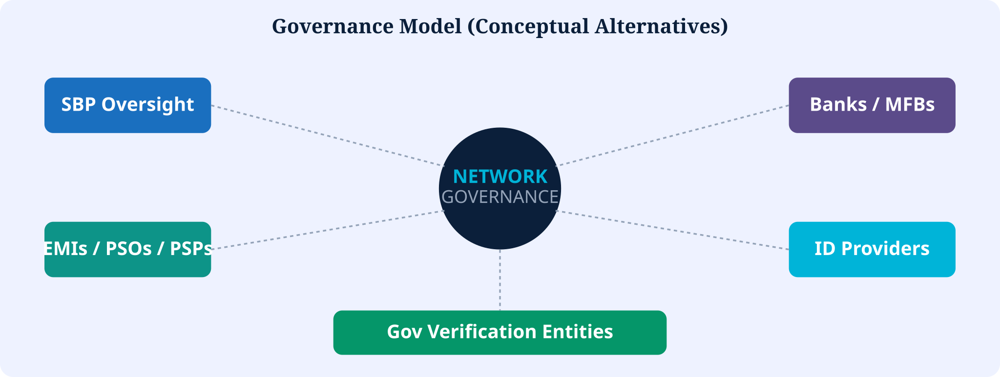

# 14. Governance


**Proposed Architecture**


Potential participants: SBP, banks, EMIs, PSOs, PSPs, MFBs, authorized identity providers, government verification entities.

Must cover: nodes, validators, data access, consent, revocation, disputes, liability, cybersecurity, audit, supervision.


SBP need **not** operate every node. Alternatives include industry consortia, hybrid supervisory nodes, or specialized utilities.


*Figure 16 — Governance model*
