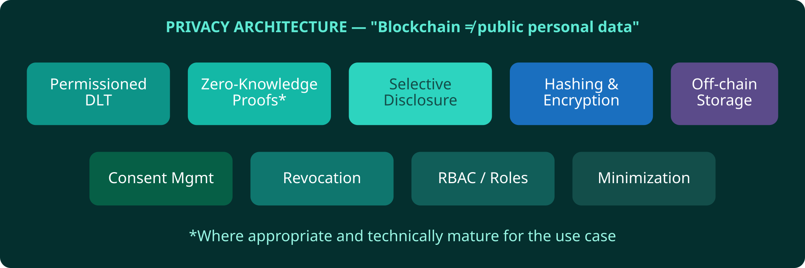

# 15. Privacy


**Proposed Architecture**


**Blockchain does not mean putting everyone’s data on a public ledger.**

Toolkit: permissioned DLT, zero-knowledge proofs where appropriate, selective disclosure, hashing, encryption, off-chain storage, revocation, consent management, RBAC, data minimization. [[8]](99-references.md#8) [[10]](99-references.md#10)


If a teenager can screenshot it from a public explorer, it should never have been personal data.


*Figure 17 — Privacy architecture*
