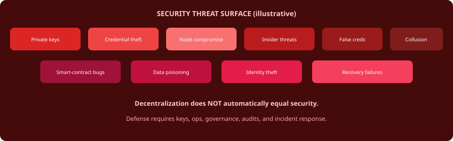

# 16. Security


**Proposed Architecture**


Threats include key compromise, credential theft, node compromise, insider threats, smart-contract bugs, validator collusion, data poisoning, false credentials and recovery failures.

**Decentralization does not automatically equal security.**

*Figure 18 — Security threat surface*
