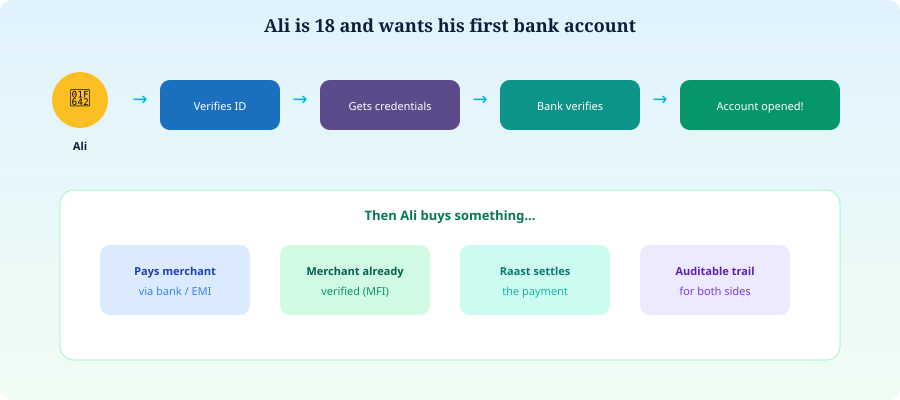

# 18. A Teenager’s Example


**Illustrative story** — fictional and simplified.


Ali is 18 and wants his first bank account.

  

*Figure 19 — Ali’s journey*


**What Ali learns:** blockchain here is less a magic money app and more a shared notary for proofs — while banks still decide, and Raast still moves the payment.

