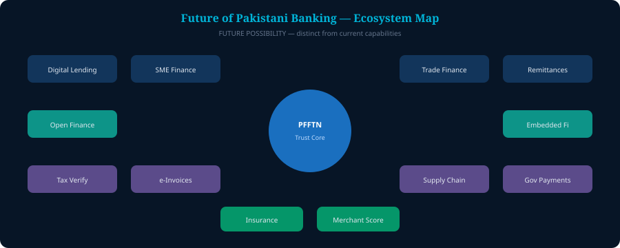

# 19. The Future


**Future Possibility** — not current PFFTN capabilities.


Possible later extensions: digital lending, SME financing, trade finance, remittances, insurance, supply-chain finance, government payments, tax verification, digital invoices, merchant credit scoring, open finance, embedded finance.

Each would need separate policy, legal and technical work.

  

*Figure 21 — Future ecosystem map*
