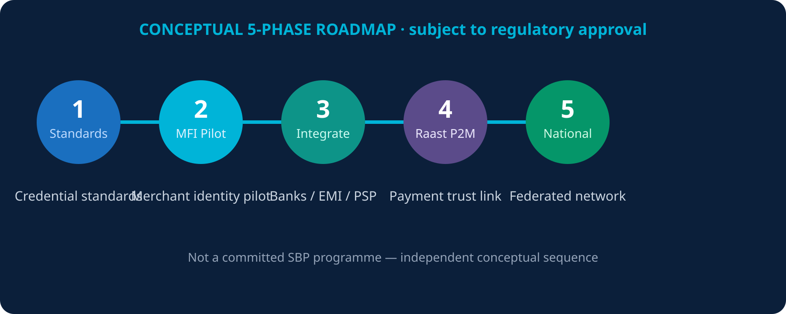

# 20. Implementation Roadmap


**Conceptual roadmap** — would require SBP/regulatory approval. Not a committed national programme.


1. **Phase 1** — Shared identity and credential standards
2. **Phase 2** — Merchant Financial Identity pilot
3. **Phase 3** — Integration with selected banks / EMI / PSP participants
4. **Phase 4** — Raast P2M integration (trust link, not rail replacement)
5. **Phase 5** — National federated financial trust network

*Figure 20 — Five-phase roadmap*
